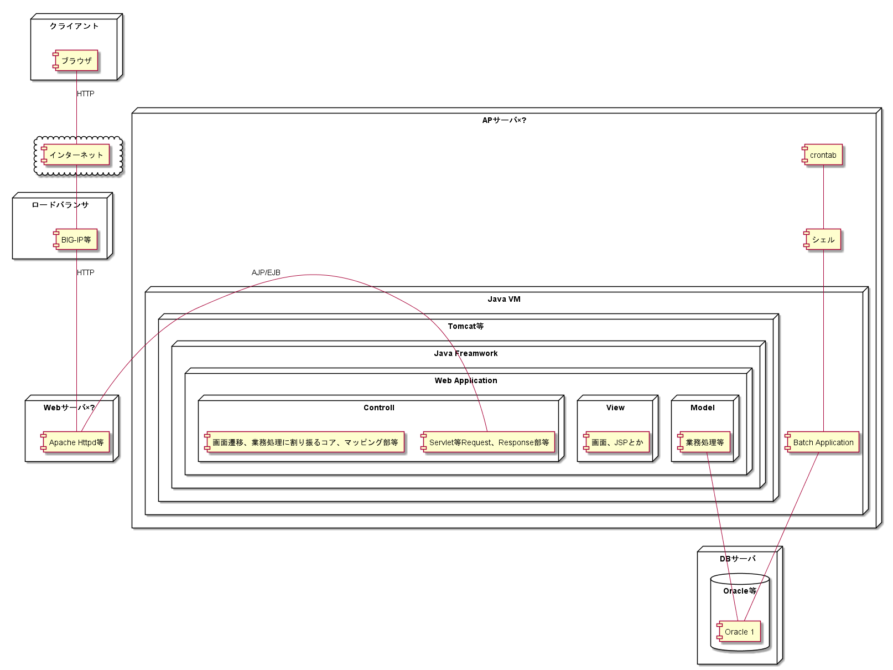

# 目的：JavaScriptフレームワークを理解して使えるようになりたい

とりあえずはやりに乗ろうとJavaScriptMVCがやってみたいということで、  
Vue.jsなどの書籍を買ってみる。

あ、これあかん、まず単語の擦り合わせからや、  
至るところにSPAという単語があるが、これ何だろ？  
知っているかもしれないが、意識せず使ってきた何かの技術名称か？  
そういうのがよくある、いけない  

ちなみに私は、SPAを聞くとどちらかというと高級ビジネス誌SPA!を思い浮かべる程度

これはいけない

# 知識の整理

ちょっと古めのJavaにおけるサーバサイドエンジニアが一般的に  
思い浮かべるWebアプリケーションの構成とは、  
どういったものだろう…自分が思い浮かべるのはいわゆる以下のような図になる

何かしらのAPサーバ上のミドルウェアを立ち上げて  
立ち上げたミドルウェアのLisnerでリクエストをハンドルし、  
Webアプリケーションのサーブレット等で受け取り、  
業務ロジックを実施して、レスポンスを返却してやるというような仕組みと思う

# SPAとはいったいNode.jsとの関係性は、メリットは…

SPAは単一のページでコンテンツの切り替えを行うWeb アプリケーションのアーキテクチャなので
上記構成で実装するとなると... 

つくりとしては  
別口のサーブレットを立ち上げて、JavaScript経由でXMLリクエストを送信して  
サーブレットで受け取って、業務ロジックを実施して、レスポンスを返却する。  
Ajaxですね、んん？SPAという観点だけでみると、別段サーバーサイドJavaじゃばでも実装できるよね？  

